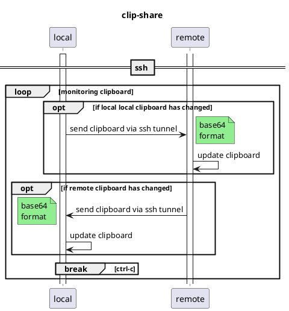

# clip share command

for clipboard sharing between local and remote environment

## how to use
1. install at local environment
1. `clip-share.sh <host name at ssh config>`

__Threre is no need to install tools at remote environment.__

## environment variable
* `CLIPSHARE_SSH_RETRY_INTERVAL`: default value is `3(sec)`

## Sequence Diagram

## FYI
`wait loop (local) <-- ssh pipe --> pipe wait loop (remote) | clipboard wait loop (remote) <-- ssh pipe --> pipe loop (local)`

### ubuntu clipboard bug
* [Clipboard error : Target STRING not available when running · Issue \#2642 · neovim/neovim · GitHub]( https://github.com/neovim/neovim/issues/2642 )
* [Error : target STRING not available · Issue \#38 · astrand/xclip · GitHub]( https://github.com/astrand/xclip/issues/38 )
* [ClipboardPersistence \- Ubuntu Wiki]( https://wiki.ubuntu.com/ClipboardPersistence )

## FMI
* [ssh - Run local script with local input file on remote host - Unix & Linux Stack Exchange]( http://unix.stackexchange.com/questions/313000/run-local-script-with-local-input-file-on-remote-host )

> assuming both your ssh client passes the LC_* variable (SendEnv in ssh_config) and the sshd server accepts them (AcceptEnv in sshd_config))

* [Copy to different user clipboard -Xorg linux - Stack Overflow]( http://stackoverflow.com/questions/10690579/copy-to-different-user-clipboard-xorg-linux )
